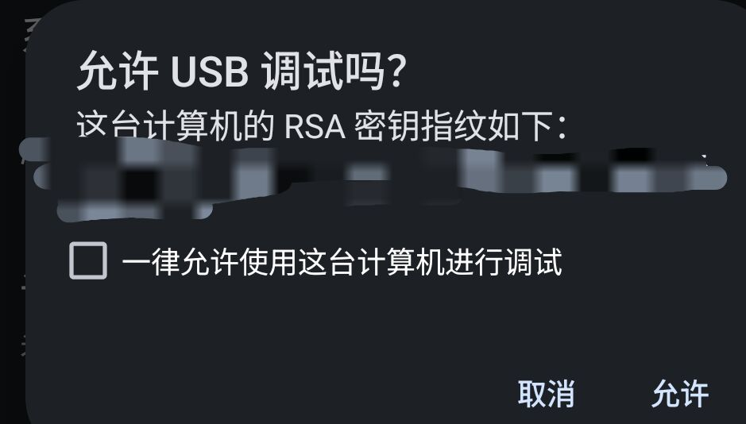
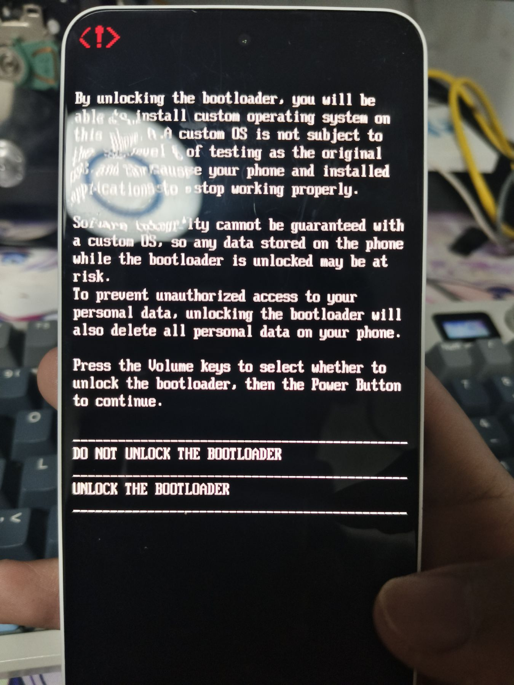
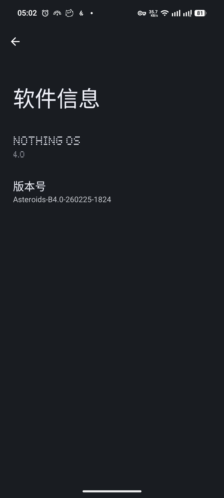
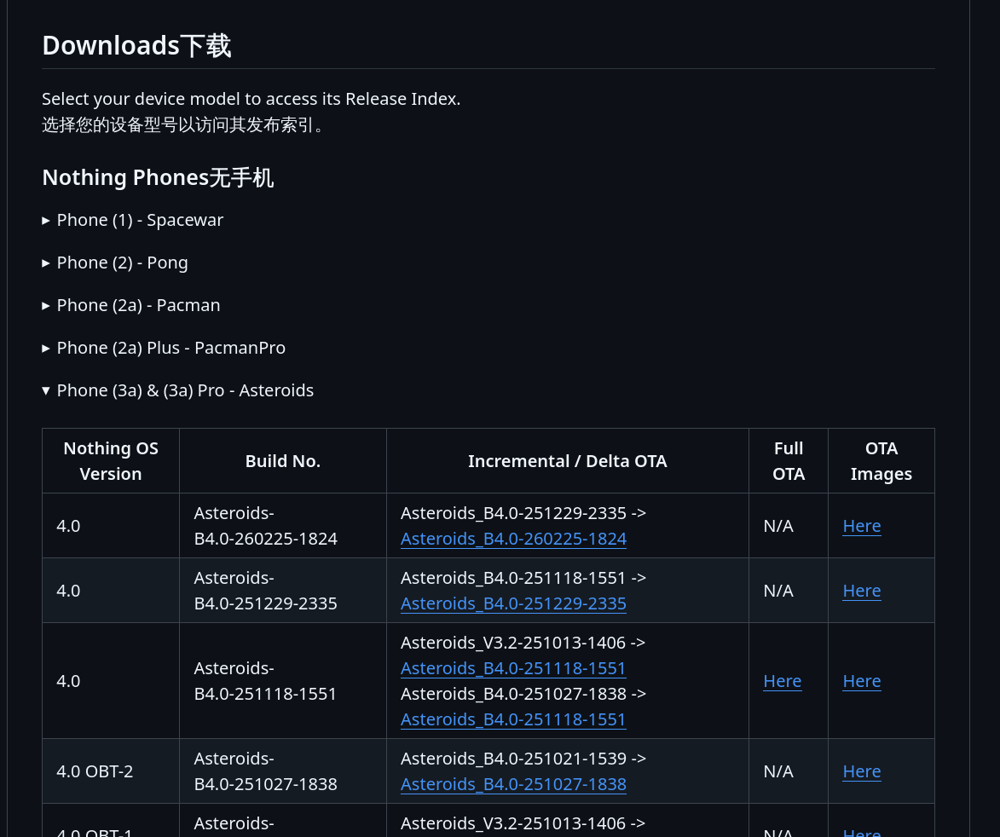
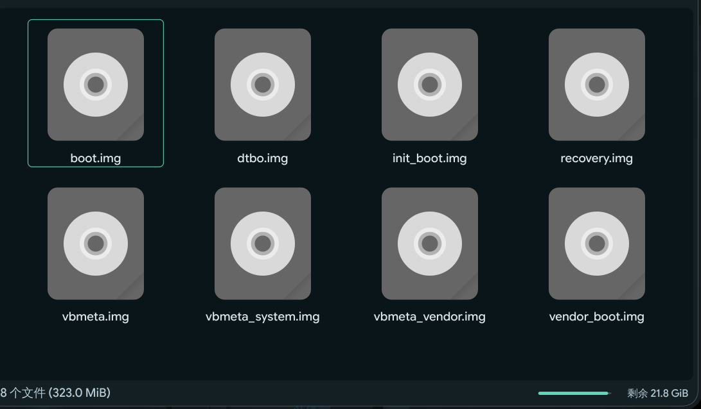

[google希望让android变成封闭系统！了解他并做些什么](https://keepandroidopen.org/zh-CN/)

这篇文章聚焦nothing的软件与root等问题,教程在后面。
文章不谈硬件，硬件评测推荐[阿哲](https://www.youtube.com/@linzin)有做系列评测，我也是在哪里第一次了解这个品牌
## 前言
nothing，在国内一个可以说是小众中的小众品牌，如果你听过他，大概可能是以下三个原因

1. 裴宇瑞典籍华人，nothing的创始人，同时亦是1+联合创始人，为了[^1]*通过翻开新篇章，我才可以花更多的时间来实现更多的创意*离开1+。只是留下西北苦行英伦三岛和何时“驱逐OV！恢复一加！光复极客！还政裴宇！”的传说
2. nothing并不在中国大陆发售，但nothing的geek感和独特的设计确实足够特立独行
3. 各种可ROOT榜

现在是个各家厂商都在收紧BL解锁的时代，**不管国内外** 国产手机在市场内卷下系统广告是重要的收入来源，对BL卡的死死的，当然都是资本主义谁也不要笑话谁，进步资本主义和特色资本主义本质还是逐利的[google的一些行为一样讨厌](https://keepandroidopen.org)。无非外国品牌在公民社会监督下更有底线，不靠广告营收还愿意给你这条路，当然价格较贵。在2026年的今天，如果想要不留下任何个人和设备信息解锁一个在售机器BL,**Google和nothing可能是你唯二的选择**

##### 个人认为的主流手机可解锁解锁甜度表

| 品牌             | 综合评价       | 流程复杂吗                               | 资源丰富吗？         | 后果                  | 私货                      |
| -------------- | ---------- | ----------------------------------- | -------------- | ------------------- | ----------------------- |
| 🏅Google pixel | ✨️✨️✨️✨️✨️ | 无限制，原生解锁，一条命令就可以                    | 100%           | 不刷第三方ROM就有保修,刷了也能蒸蒸 | 最完美的                    |
| 🥇Nothing      | ✨️✨️✨️✨️   | 限制是nothing，原生解锁，一条命令就可以             | 拉点，不过在好转       | 暧昧，条款没明白说，看情况       | 第三方ROM适配并不乐观            |
| 🥈1+           | ✨️✨️✨️     | 绑定大陆号码申请，30天限制一次，不过据说很好过，而且高考好      | 有望成为最大国产root社区 | 保修政策收紧，完整三包没了       | 《1+—裴宇的遗产》，是否继续加码我不是很乐观 |
| 🥈sony         | ✨️✨️✨️     | 不用账号用IMEI 1&IDID                    | 不错             | 失去原厂照相算法            |                         |
| 🥈3星           | ✨️✨️✨️     | 类似sony                              | 不错             | 熔断Knox,失去pay和隐私功能   | 感觉熔断Knox挺没性价比           |
| 🥉小米           | ✨️         | 小米高考臭名远扬，都出体育特长了，KernelSU作者都过不了的含金量 | 目前国内最大root社区   | 有权利拒保               | 及其差劲的示范，当婊子立牌坊          |
| 🥉摩托罗拉         | ✨️✨️       | 硬件ID+账号                             | 有些积累           | 申请就拒绝               |                         |

### Nothing在软件上适合谁？

**首先肯定不是大多数人，nothing的性价比不适合当打游戏机，创意的外观和软件才是重要的卖点**。首先说nothing的用户群体，geek是一个绕不过的标签，裴宇时期的1+就在打，nothing更是一个极致。事实上nothing OS的设计语言的确独具一格，点阵字体和简洁加上冷感的UI语言。nothing有很多很棒的原生应用

比如[nothing天气](https://play.google.com/store/apps/details?id=com.nothing.weather&hl=zh)是我最爱的天气app流畅美观简洁，非常unix哲学。有的只有看天气一件事情，可惜api在大陆有点慢。

原版nothing OS就已经是一个不错的类原生系统，界面流畅，完整的GMS。可惜就是还是有点简陋和不足，那么最后变成完美的拼图就是它——ROOT权限

而nothing告诉你：去吧，亲手拼上它吧


## ROOT前&解BL教程
其实没什么好教的非常简单：

1. 解开BL
2. 刷入修补后的init_boot.img
3. 完事

一步步来吧，我选择的是线刷，说的当然就是我的方案：

### 手机端准备
1. 打开开发者模式
2. 备份重要数据（开BL会消除所有数据）
3. 找稳固的USB—C线连接PC和手机（比如手柄线，中途别掉了）    

### ADB和进入
⚠️除了Arch我都没亲自尝试,仅供参考
###### win：去 Google 官网下载 [SDK Platform-Tools](https://developer.android.com/studio/releases/platform-tools)。解压后最好把文件夹路径加到系统的 **环境变量 (PATH)** 里，不然你每次都要切换到那个文件夹才能运行。Nothing 官方没有专门的 ADB 驱动，直接用 Google 提供的 [USB Driver](https://developer.android.com/studio/run/win-usb) 即可。如果识别不到，去“设备管理器”里手动更新驱动，选择“从计算机上的设备驱动程序列表中选择” -> “Google USB” -> “Android ADB Interface”喵。

##### GNU/Linux
**Arch系**：通常需要`sudo pacman -S android-tools` 和管理权限的`sudo pacman -S android-udev`

**Debian系**：`sudo apt update && sudo apt install android-sdk-platform-tools`

**Redhat系**：`sudo dnf install android-tools`

**NIX OS**：在 `configuration.nix` 里加上：

```
programs.adb.enable = true;
users.users.<你的用户名>.extraGroups = [ "adbusers" ];
```

然后执行 `sudo nixos-rebuild switch`

**gentoo**： `sudo emerge -a dev-util/android-tools`
##### MAC&BSD
 **MAC**：装了 Homebrew 的话 `brew install --cask android-platform-tools`

 **FreeBSD:** `sudo pkg install android-tools`
 
 **OpenBSD:**  `sudo pkg_add android-tools`
 
注意：BSD 下可能需要以 root 身份运行 `adb start-server` 才能识别硬件。

### Bootloader解锁
⚠️解锁最好用软路由,热点之类的**搭建一个可以访问google的环境，解开BL通常要验证此前的google号也就是FRP**这里简单介绍一下
跳过 Google 验证 (FRP Lock)的一些方式

**最简单的格式化前退出任何google账号就不会触发**  

如果手快已经卡了怎么办？
 运行`fastboot erase config` 或`fastboot erase frp`不过我亲测试都没用
 
我遇到过这种情况最后方法是装个可以开adb的recovery然后`adb shell content insert --uri content://settings/secure --bind name:s:user_setup_complete --bind value:s:1`就好了

首先检查连接并确保[[#手机端准备]]已经完成
连接PC一般会出现一个ADB授权弹窗，允许你的设备调试

然后测试连接`adb devices`
返回设备信息就可以下一步重启`adb reboot bootloader 
正常就会进fastboot
运行解锁命令`fastboot flashing unlock
这时候会出现下面的画面

⚠️解锁会清除数据，请确定重要内容的备份
接下来
- 使用 **音量键** 切换选项。
    
- 选择 **"UNLOCK THE BOOTLOADER"**。
    
- 按下 **电源键** 确认。 

就是这么简单

## 获取ROOT
[nothing档案馆](https://github.com/spike0en/nothing_archive)
接下来是获取root，你可以选择喜欢的root管理器目前的主流有两个管理器分支
这些在中文互联网就讨论比较多了，我就简单带过了
1. **Magisk** GPL-3.0开源，老牌root管理器，资源丰富，体系成熟，不过隐藏效果更糟糕。主要贡献者是roc人吳泓霖，目前好像进google了有点幽默，Magisk项目是roc第二大的开源项目，可惜来源网站为找不到了，找到再来编辑吧，比较好的fork有阿尔法面具，集成了隐藏功能
2. **KernelSU** GPL-3.0开源，特点如名字，内核级root,优点就是不用做隐藏了，缺点就是就像wayland还没熬成婆，主要贡献者是中国人weishu,这位大佬也是太极的主要贡献者，[^2]在小米高考斩获30/100，主流fork是SukiSU-Ultra，有更多功能和diy主题

简单来说root管理器会让你把调教过的组件刷入内核获取root权限，在nothing刷入的都是init_boot.img，获取方式最简单的就是[nothing档案馆](https://github.com/spike0en/nothing_archive) 这里收录了几乎所有nothing机器root需要的资源，以我的3A为例，在设置>关于本机>nothing os>找到你的小版本号


### 获取boot文件
接下来在[nothing档案馆](https://github.com/spike0en/nothing_archive) 下拉到下载区找到对应版本的**OTA Images**
下载大概30m的boot就可以了，比如我的[Asteroids_B4.0-260225-1824-image-boot.7z](https://github.com/spike0en/nothing_archive/releases/download/Asteroids_B4.0-260225-1824/Asteroids_B4.0-260225-1824-image-boot.7z)解压缩会得到

我们要的就是init_boot.img,貌似不少较老的设备都是boot.img,市面上的教程大多都是boot.img区别就是`init_boot`：存放的是 Generic Kernel Image (GKI) 的 **ramdisk**（KernelSU 通常修补这里）。**`boot`**：存放的是 **内核镜像 (kernel)** 本身。

我第一次也是看教程刷入boot.img结果就是没有用，这算是一个小坑。

接下来把他传送到手机，安装你要的root管理器在主页安装的字样然后选择init_boot.img。

你的管理器就开始调教init_boot.img了，然后会输出需要的init_boot.img，看好输出的路径，一般在下载文件名是管理器+时间，比如我的kernelsu_patched_20260309_105834.img

### 刷入
然后就是刷入三板斧：
1. 进Fastboot
`adb reboot bootloader`
adb重启动到Fastboot 模式，进入后可以用`fastboot devices`确认连接

2. 刷入
`fastboot flash init_boot （目标路径）`
这条命令通常会自动刷入当前活动。求稳妥也可以A/B一个个刷入`fastboot getvar current-slot`确认当前活动分区`fastboot flash init_boot_a  （目标路径）` 这样子

3. `fastboot reboot`
重启后就可以了，打开root管理器，大概就是活动中的状态了

调教前的boot不要删如果系统更新就刷回去，然后就可以获取更新了
## ROOT了，然后有什么用呢？

**ROOT是手段不是目的**
很多人炒作root，然后跟随潮流装上管理器，然后就虚无了。关于root可以做到的美妙事情有时间我会写个专门的文章，在这里我简单介绍一下**Zygisk&LSPosed**和自己的一些有趣（并不）经历


### Zygisk&LSPosed
LSPosed是现代化的框架实现，国内有高雅称呼——老色批。虽然严格来说也有Riru这类的，Zygisk 的核心逻辑是注入到 Android 的守护进程 `Zygote` 中。`Zygote` 是所有 App 的父进程，权限极高。主流的实现是基于Zygisk注入，Zygisk就基本是root的专利了。

刷入Zygisk基本有三个选择
1. Zygisk next 主流的选择，不过可惜的是next已经停止开源。看了下贡献者三个贡献者里有大名鼎鼎的[5ec1cff](https://github.com/5ec1cff)就释怀了， 这位千早爱音大佬的项目好多都闭源了，这项目据说是三贡献者讨厌有人把自己开源的软件魔改闭源卖钱干脆自己闭源了，不过我没有找到可靠的来源。老实说这三贡献者人品都很好爱音更是贡献了海量root相关的软件，next也依然是主流，不过不是我洁癖，把Zygisk注入这么重要的位置给闭源软件........**我不推荐任何人刷入**，亿万人得使用开源替代。
2. reZygisk 主要开源替代GPL-3.0许可证，没感觉有什么差，不过这个模块在我的环境[Releases 4](https://github.com/PerformanC/ReZygisk/releases) 版本刷入错误，需要找[Actions](https://github.com/PerformanC/ReZygisk/actions)版本，然后就没事了，完全的无感替代
3. neoZygisk，一样的GPL-3.0协议,开发者很勤快貌似集成了很多更激进的功能，包大小是三家最大的，[Releases 4](https://github.com/PerformanC/ReZygisk/releases)一次成，不过我不考虑隐藏，干脆还是用了更加轻量的reZygisk
 
 然后刷入就是傻子都会了，下载zip包，刷入，重启，完成。
 LSPosed的模块多使用apk包发布，下载，然后在 LSPosed里授权。
 LSP有许多各种模块，我自己也打了不少，挡个闪照，改个图片外显，甚至开挂。

### 一些警告和我的糟糕经历

 说到这个，我是挺挺讨厌挂逼的，我几乎不打多人游戏，手游开挂打pjsk感觉有点幽默。
 
 我从来没装一个挂就是了，不过我知道不是挂逼也要小心恶意模块！！！一手发布恶意模块一手救砖产业链了已经。
 
 **⚠️千万要看好模块，小心格式化！！！只要获取了root权限就可以格机⚠️**

选择一定是 开源>github闭源仓库>**不知道谁分享的蓝奏云连接**

其实一般格影响不到硬件就是了，只要fastboot可以进基本个人都可以救，9008也建议求助XDA或者nothing社区，目前不少机型明面上已经有了EDL教程[ph1](https://www.xda-developers.com/nothing-phone-1-unbrick-9008-fix/) [ph2](https://droidwin.com/how-to-unbrick-nothing-phone-2-via-edl-firmware-and-flash-tool/) 记住**没到山穷水尽不花钱**

博主小白时期也曾有一次请别人的经历，不过我是患了一个巨蠢的错误——看错版本号了，刷入了错误了boot.img 结果一次报错，心态崩了，然后病急乱投医，刷入了错误的完整OTA,结果很灾难，fastboot可以进的情况下，我看了一眼[lineageos](https://wiki.lineageos.org/devices/#nothing) 不支持加上自己吵架干啥心情巨糟糕感觉自己啥都能搞砸，就差跳了，就放弃了，现在想想还肉疼，后来一看[nothingTG社区](https://t.me/NothingPhone3aUpdates) 一堆Unofficial系统和热情印度老哥好像也可以找找完整包，随便哪个Unofficial系统一刷就省100。绝对是我花的最冤枉的钱，现在回忆起来还是后悔。

**我的教训就是**

1. 切记：忍耐，要忍得住想的开，心态一定要好。

2. 无论LLM和自己的想法一定都有不足的，一定要查证！

3. 不要放弃！！


最后，祝各位好运！！

## 结尾和私货


pgntgz

26-3-9～3-11编辑完成

这是这个博客第一篇文章，有很多不足，没办法，我水平也就那样,有发现不对的会来小修小改。

但我真的受够了中文内容的圈子化。明明很多事情不需要那么麻烦，明明我们不需要llm做中间商，我不想要流量焦虑，bolg挺好，流量数据是抽象的不用焦虑，网站属于自己，，也有创作自由。我就要在一个可以被Google索引的地方留下一点东西。下一篇打算继续聊root。

文章引用图片均为本人拍摄，封面图[来源](https://commons.wikimedia.org/wiki/File:Nothing-Tokyo-2024-04-18_092.jpg) 使用 CC 4.0发布，所以我标注来源后可以使用它


[^1]: 来源;[环球网 2021-01-27](https://m.huanqiu.com/article/41ge6BOWV5y)，这一部分是通用的

[^2]: [来源](https://www.zhihu.com/question/659213282/answer/3536196293)
